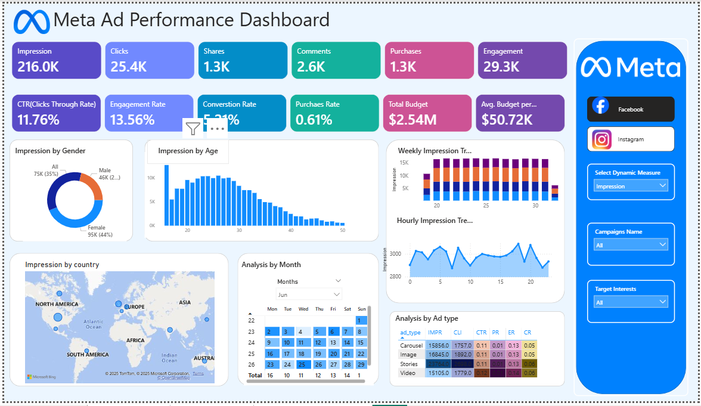

# 👨🏻‍💻Customer Behavior Analysis – Retail and E-commerce Analytics

_The business needs a performance tracking report for advertising campaigns running on Facebook and Instagram._

---

## 📌 Table of Contents
- <a href="#overview">Overview</a>
- <a href="#business-problem">Business Problem</a>
- <a href="#dataset">Dataset</a>
- <a href="#tools--technologies">Tools & Technologies</a>
- <a href="#project-structure">Project Structure</a>
- <a href="#research-questions--key-findings">Research Questions & Key Findings</a>
- <a href="#dashboard">Dashboard</a>
- <a href="#how-to-run-this-project">How to Run This Project</a>
- <a href="#author--contact">Author & Contact</a>

---
<h2><a class="anchor" id="overview"></a>Overview</h2>

This is a Meta Ad Performance Dashboard that tracks the effectiveness of ad campaigns 
across key KPIs such as impressions, clicks, engagements, conversions, and budget.
---
<h2><a class="anchor" id="business-problem"></a>Business Problem</h2>

- Identify the most effective platform (Facebook vs Instagram). 
- Track campaign ROI and optimize budget allocation.
- Understand audience engagement patterns.
---
<h2><a class="anchor" id="dataset"></a>Dataset</h2>

-Table 1: ad_events ---> Stores event-level logs. Used to analyze when and how users interact with ads.
-Table 2: ads ---> Contains details of each ad creative.Used for platform-level and creative-type-level analysis.
-Table 3: campaigns --->High-level campaign strategy and budget allocation.
Used to calculate cost-based KPIs.
-Table 4: users --->Stores demographic and interest information of users who interact with ads.Helps analyze targeting efficiency. 
 
---

<h2><a class="anchor" id="tools--technologies"></a>Tools & Technologies</h2>

- Microsoft Excel
- Power BI (Interactive Visualizations)
- GitHub

---
<h2><a class="anchor" id="project-structure"></a>Project Structure</h2>

```
customer-shopping-behavior-analysis-sql-python-powerbi-gammaai/
│
├── README.md
├── .gitignore
├── requirements.txt
├── Business Requirements Document.pdf
├── Analysis Report.pdf
│
├── dataset/                  # csv file
│   └──ad_events.csv
│   └──ads.csv
│   └──campaigns.csv
│   └──users.csv
│
├── images/                  # png file
│
├── dashboard/                  # Power BI dashboard file
│   └── meta_ads_performance_analysis.pbix
│
```

---
<h2><a class="anchor" id="research-questions--key-findings"></a>Research Questions & Key Findings</h2>

1. **Strong awareness & engagement, but low purchase efficiency → optimize landing pages, retargeting, and offers. **
2. **Target audience = young females, 18–30, in India & Brazil →**
3. **Best formats = Video and Stories → increase spend here. **
4. **Best times = afternoons & evenings **
5. **. Geography → volume from India/Brazil, value from Germany/UK → segment strategies.**
---
<h2><a class="anchor" id="dashboard"></a>Dashboard</h2>

- Power BI Dashboard shows:
  -KPI Metrics:need to optimize targeting/landing pages. 
  - Engagement Breakdown :Target ads towards females aged 18–30 for better ROI.
  - Geographic Distribution :Focus campaigns in India & US and premium 
campaigns in Germany/UK
  - Time-Based Trends :Schedule ad delivery during afternoons & evenings for maximum impact. 
  -Calendar View : Weekly promotions/events significantly drive engagement.
  -Analysis by Ad Type (Bottom-Right Table) : Focus budget more on Video & Story ads for better ROI. 



---
<h2><a class="anchor" id="how-to-run-this-project"></a>How to Run This Project</h2>

1. Clone the repository:
```bash
git clone https://github.com/roshani31/meta-ads-performance-dashboard-powerbi.git
```
2. Load the CSVs:
```bash
dataset/ad_events.csv
dataset/ads.csv
dataset/campaigns.csv
dataset/users.csv
```
3. Open Power BI Dashboard:
```bash
 `dashboard/meta_ads_performance_analysis.pbix`
```
---

<h2><a class="anchor" id="author--contact"></a>Author & Contact</h2>

**Roshani Thombare**  
Data Analyst  

